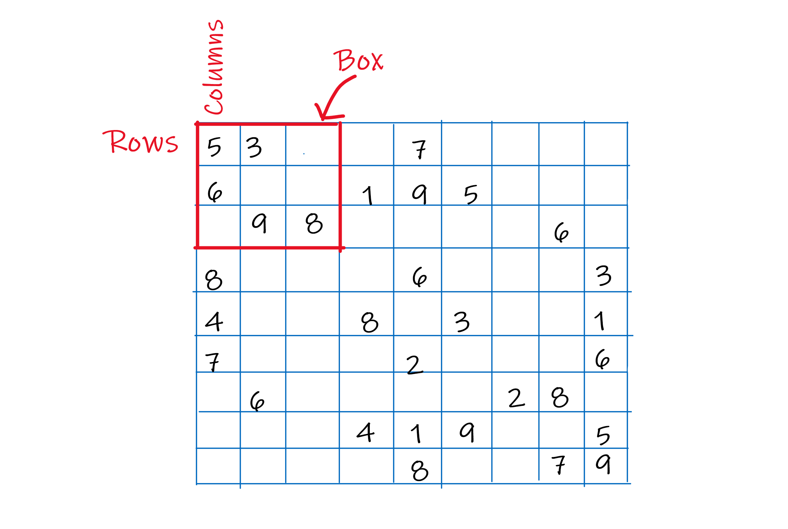
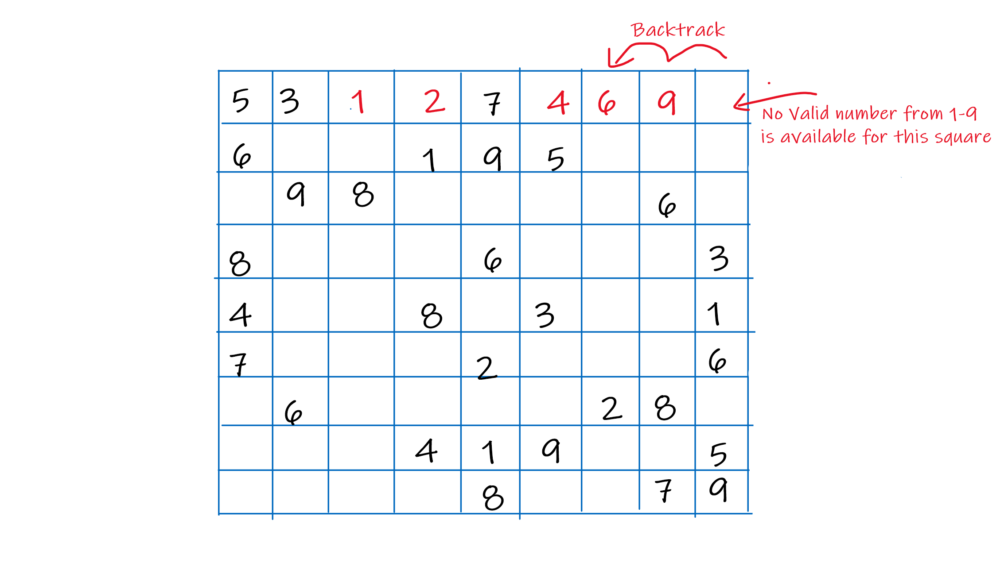

### What is Backtracking?
Backtracking is a wonderful algorithm which can be used for solving various *"constraint satisfaction"* problems. Some of them include *n-Queens problem*, *Map Coloring problem* or *Sudoku solving problem*. Here we'll discuss Sudoku Solving.

Sudoku is 9 x 9 grid which has numbers from 1-9 written on it. Some spaces in grid are left blank and are to be filled by the user. The constraint here is to fill the numbers in the grid in such a way that no number is repeated, not in any row (horizontally), or column (vertically) or any 3 x 3 box.

Following picture explains the constraints:


### Naive approach
Now at the first look, the approach one might come up would be simple,

 - Find all the empty squares in grid
 - Try out every possible combination of filling empty squares one by one by placing numbers from 1-9 on empty squares
 - Check if the state of Sudoku after filling all the empty squares is valid
 - Continue the process

Now, this is one correct approach, but it is not feasible. Why? Let's consider the complexity of this approach.
There are 9 rows and 9 columns. So in total, there are 81 squares in the grid. Considering the fact that each square can have numbers from 1-9 means that each square can have 9 different ways of being filled by any number.
Now this, extending to the entire grid, we get **9^81** different combinations of the sudoku grid where each square has numbers from 1-9.
Now this number is massive, even a computer with 64 GB memory can face difficulty calculating this.

### Backtracking approach
So how does Backtracking improve the complexity? It's Simple. Let's see how.

 - When you see an empty square, start checking the validity of sudoku by placing the number one by one from 1-9.
 - If it is valid, place the number and move to next empty square.
 - Continue the same process here
 - At some point, it may be possible that no number can be placed. So we *backtrack*.
 - We move to the last square that we filled and we find another valid number for this square.

To further understand, refer this image:


Here for the last square, we cannot find a valid way to fill, so we move to last-filled square, *i.e.* the square on the left. We cannot find a way to fill this square in any other way than 9. So we backtrack again, to square with value 6. Here we find that we can fill this square will 8 also. So we place 8 there and move on.

[Here] (https://upload.wikimedia.org/wikipedia/commons/thumb/8/8c/Sudoku_solved_by_bactracking.gif/260px-Sudoku_solved_by_bactracking.gif) is a nice animation from Wikipedia.

Here is a code snippet of the same:
```python:title=solve.py {13}
def backtrack(sudoku):
    for i in range(len(rows)):
        for j in range(len(cols)):
            if(sudoku[i][j] == 0):
                for n in range(1, 10):
                    # Check if n can be placed
                    if(is_valid(sudoku, i, j, n)):
                        sudoku[i][j] = n
                        # Base Case of Recursion, when sudoku is solved and no empty space
                        if(backtrack(sudoku)):
                            return True
                        # Set the square back to 0, as the combination is not valid
                        sudoku[i][j] = 0
                # No valid k is found
                return False
    return True
```
So now let's analyze the time complexity of this approach.
If we fill 1 in first square of the row, we have (9-1) *i.e.* 8 possibilities for the second square. Similarly 7 for third, 6 for fourth and so on. So each row has 9! combinations. And multipliy it with 9 rows, you get **(9!)^9** which is still a large value, but really low as compared to **9^81**. Roughly 10^27 times lesser!

### Conclusion
So we saw how much improvement backtracking algorithm is over normal recursive approach. Though, there are now more intelligent approach which are even better than backtracking and can solve in even lesser time than backtracking algorithm. But backtracing is still one very important algorithm which is used to solve many problems.

The entire code of the application can be found [here](https://github.com/inflame07/sudoku-solver).