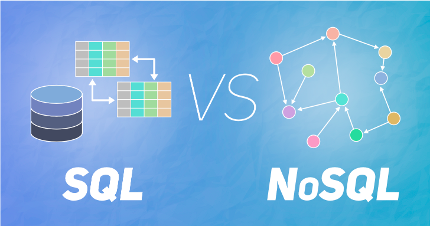

Databases are used by almost all application that we create. If you want your application to store data at some point, then database is a must. But then the question arises which database to use, **SQL or NoSQL**? 


## What are SQL databases?
**SQL** databases are traditional databases that everyone has a picture of in their minds. It has rows and columns. Generally, each row represents an entity and each column of the row represents some attribute of the entity.
*For example:*
Consider this table1.

| Employee_ID | Employee_Name | Age |
|-----|-----------|---:|
| 001 | John Doe  | 37 |
| 002 | Jason Fox | 29 |
| 003 | Mary Jane | 21 |
Here, *Employee_Name*,*Age* and Employee_ID are attributes of each Employee.


Let's us consider a second example. Consider this table2.

| Employee_ID | Position | Salary |
|-----|-----------|-------|
| 001 | Tech Lead | 700000|
| 002 | SDE 1     | 30000 |
| 003 | Intern    | 4000  |
Now, let's say you want to get all the names of people who are at the position of Tech Lead. Note that the second table does not have the names of the Employees, but only *Position*. So you'll have to perform **JOIN** between two tables. Both the tables have one column common: *Employee ID*. So the query you need is-

> SELECT t1.Employee_Name, t2.Position,
>
> FROM table1 t1
>
> INNER JOIN  table2 t2
>
> ON t1.Employee_ID=t2.Employee_ID
>
> WHERE Position="Tech Lead"

There result of this query will be:

| Employee_ID | Employee Name | Position |
|-------------|---------------|----------|
| 001         |   John Doe    | Tech Lead|
Thing to note here is that *Employee_ID* attribute ***links*** both the tables together and establishes a relation between them. So SQL databases re also called RDBMS (Relational Database Management Systems).

## What are NoSQL databases?
**NoSQL** databases are different from SQL databases in way that they don't store data in a traditional row and column format. But in a key-val format or document-oriented format or graph-based format. 
*For example:*
MongoDB, an example of NoSQL database, stores data in the form of documents in the database. 

But before creating a database, MongoDB creates a cluster and within this cluster, it creates multiple databases. Within each database, you have multiple documents (*collection*) and in each document, lies your data.
> Cluster (has) -> Databases (have) -> Collection of Documents (have) ->  Data.

Each document has some data that is stored in the form of JSON.
An example of JSON would be
```json
{
    "name":"Jhon Doe",
    "Position":"Tech Lead",
    "Age": 37,
    "Salary":"700000",
}
```
So each person in the document is a JavaScript Object. So the entire table1 if stored in MongoDB would look like this.
```json
{
    "Jhon Doe": {
        "Position": "Tech Lead",
        "Age": 37,
        "Salary": 700000
    },
    "Jason Fox": {
        "Position": "SDE 1",
        "Age": 29,
        "Salary": 30000
    },
    "Mary Jane": {
        "Position": "Intern",
        "Age": 21,
        "Salary": 4000
    }
}
```
Each employee is a JSON object and each object has some fields associated with it.
Now, if you want to query some data in the document, the query would go like:
> db.employeedata.find( { "position" : "Tech Lead" } )

Here *employeedata* is the name of the collection where our data is stored.
This query is equivalent to the SQL query above.


Thing to note here is that as data is stores in JSON format, adding a value becomes easy. *For example,*
If you want to add attribute *End Date* of internship for Mary Jane, so the table becomes:
```json {5}
"Mary Jane": {
    "Position": "Intern",
    "Age": 21,
    "Salary": 4000,
    "End Date":12-07-2020
}
```
Same goes for deletion. If you delete the *Salary* field from Mary Jane, the entire database does not get affected. But in case of SQL, if you want to delete *Salary* of a entity, you have to delete *Salary* for all the entities.
## Differences between SQL and NoSQL

| No. | SQL | NoSQL  |
|---|-----|--------|
| **1**  | Fixed Schema (Row and Columns) | Flexible Schema (JSON) |
| **2**  | Useful to make Complex Queries (JOINS)| Complex queries are not possible |
| **3**  | Follow ACID properties | ACID properties not guaranteed |
| **4**  | Vertically Scalable (By increasing CPU/RAM) | Horizontally Scalable (By adding more servers to pool) |
| **5**  | MySQL, MS-SQL, Oracle, PostgreSQL | MongoDB, Cassandra, Redis |

## Conclusion

- If you want to develop a application that will be storing sensitive
    data or any other application where you think that data should be
    consistent throughout the database (ACID properties), you should go for **SQL** database.
    That is why databases used by banking applications, Air Ticket booking websites and other online booking sites always use SQL.
- If you are developing a application where security is not a issue, or you
    expect that user is not going to perform complex queries such as JOINS, or maybe just you want to have a flexible schema for database, go for **NoSQL** database. That is why database used by EA Sports for storing the user preferences and user data, is NoSQL.