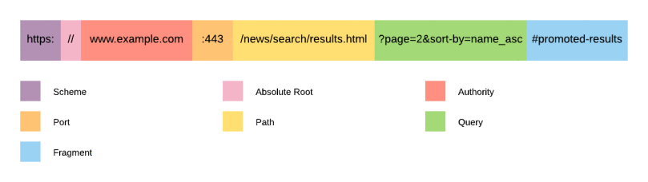
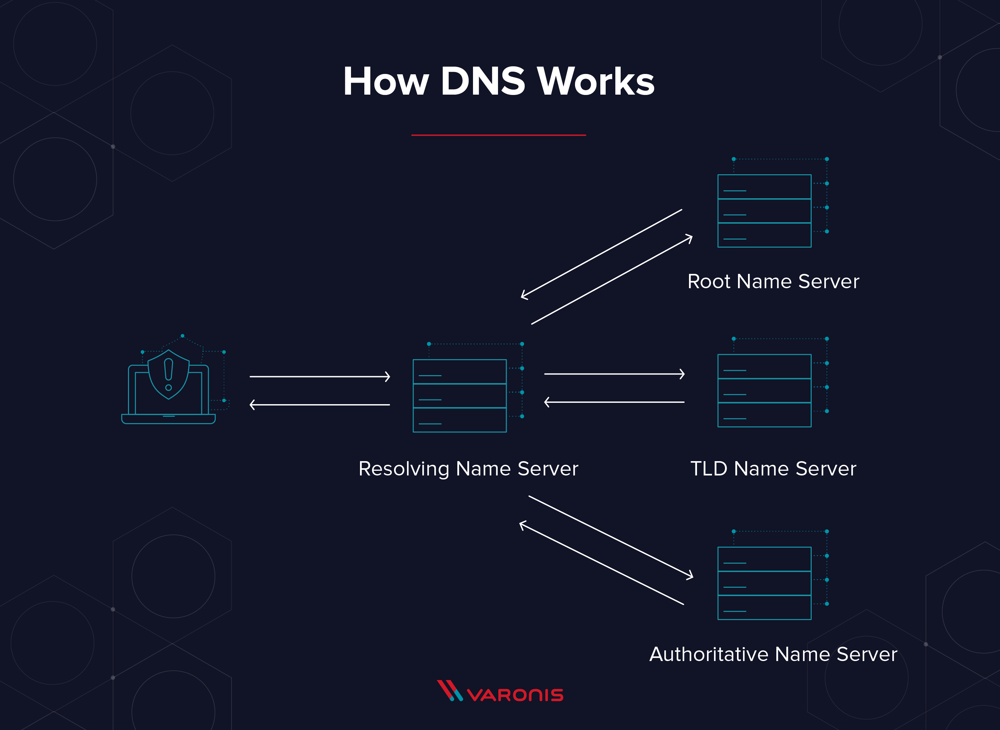
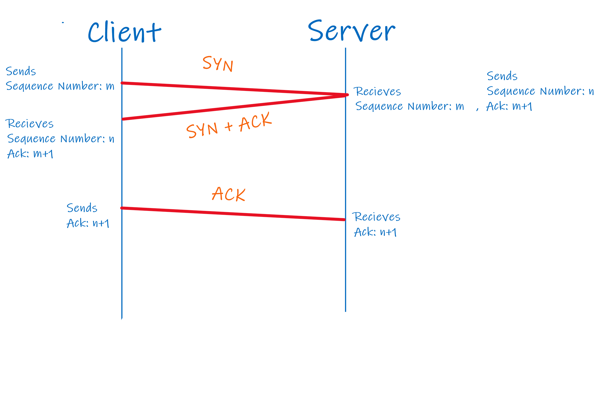

One of the most asked questions during the interviews of freshers is this: "*Explain to me what happens when you search something*". So today, let's dive into it and crack it once and for all.

**Overview of things**
 - Typing URL and hitting Enter
 - Check HSTS list
 - DNS Lookup
 - TCP Handshake
 - TLS Handshake

### Typing URL and hitting enter
As soon as you hit enter after typing "www.facebook.com", the browser first parses the URL. Now it has following information with itself,

 1. Protocol http: Use HTTP (Hyper Text Transfer Protocol)
 2. Resource '/':  Fetch the main page. If you had entered "www.facebook.com/profile.php/id=123xde", the browser would fetch the page with id=123xde accordingly.


Thing to note here is that by default, browser sends a HTTP request and not a HTTPS request because it is not the browser's responsibility to ensure that the website is secure. It relies on the website to make the necessary redirection and support HTTPS.

### Check HSTS list

Every browser comes preloaded with the HSTS (HTTP Strict Transport Security) list. If a website is persent in this list, the browser will send a HTTPS request for that website. Accordingly, for every search, the browser searches this list and if it is present, it will send a HTTPS request.

If in case, a new website pops up and it is not included in the HSTS list, the first response recieved from its server will have a HSTS header which will instruct the browser to add this site in the HSTS list.

Example of HSTS header:


```Strict-Transport-Security: max-age=31536000; includeSubDomains```

### DNS Lookup

Now the browser tries to get the I.P address of the URL entered by the user. For this first it looks into the cache memory.

 1. Browser Cache
 2. OS Cache
 3. Router Cache
 4. ISP Cache
 5. DNS Recursive


After looking into all these, if I.P address is still not found, it starts the DNS recursive search which is the meat of the topic.


Before proceesing further, it is important to understand the different parts of URL and what they represent.





DNS Lookup is done in many steps.

 1. **Root Name Server**: Root Name Server tells the resolver that the site you are looking for is of ```.com``` domain by looking at the extension of URL. and provides the resolver I.P address of the TDL Name Server that has all the ```.com``` domain sites.
 2. **TLD Name Server**: Now resolver goes to the Top Level Domain (TLD) name server using the I.P address provided by the Root Name Server. This name server then gives the I.P address of the Authoritative Name Server.
 3. **Authoritative Name Server**: The Authoritative Name Server finally gives the I.P address of "www.facebook.com" to the resolver.


### TCP Handshake

After the browser receives the I.P address of the website, it takes that and the default port number (80 incase if HTTP and 443 incase of HTTPS) and makes a call to the function named socket in system and requests a TCP socket stream.

After socket has been opened, client initiates the TCP handshake.

 - Client chooses a sequence number for packet and sends the packet to server with SYN bit set to 1.
 - Server recieves the SYN and responds to client with the SYN-ACK bits set to 1. ACK to denote that it has recieved the packet and SYN to denote what sequence number it is likely to start the segments with.
 - Client acknowledges the response of server and now data transfer can start.



### TLS Handshake
After TCP handshake, TLS handshake starts.

 1. The client system then sends a ```ClientHello``` message to the server with its TLS version, list of cipher algorithms and compression methods available.
 2. Server replies with the ```ServerHello``` message with the selected cipher algorithm, selected compression method and its own public certificate signed by the CA. This certificate has the public key that will be used to encrypt the messages until a symmetric key is decided.
 3. The client verifies the certificate of server with its list of trusted CAs and now both the client and server agree on a symmetric key.
 4. After symmetric key has been decided, the client sends a ```Finished``` message encrypted with the decided symmetric key.
 5. Now data transfer can occur between both using the symmetric key.


So far, I have gone through all the major things that happen, although there are many minute details that you can get to know from [this](https://github.com/alex/what-happens-when) GitHub repo by Alex. *Thanks to Alex!*


*P.S This post will be regularly updated as I dive deeper and deeper into the topic.*